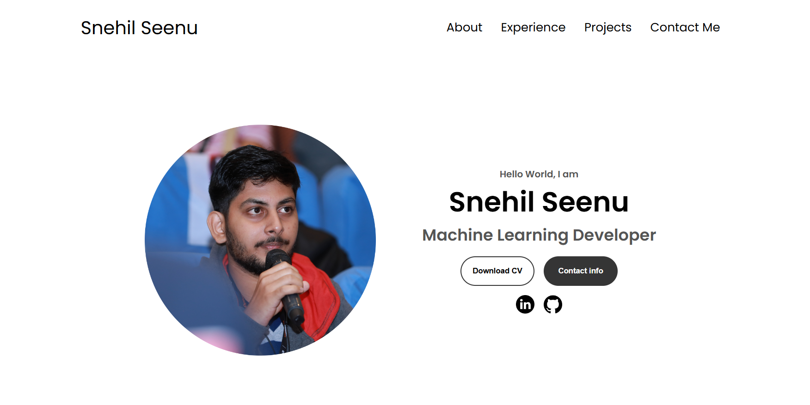

# 🌐 Minimalist Portfolio Website

Welcome to my minimalist portfolio website! ✨

This project showcases an elegantly designed, simple, and clean portfolio site. It’s created to highlight my skills, projects, and professional journey in a distraction-free, visually appealing way. With a focus on a seamless user experience, this site offers an intuitive layout for exploring my work.

## 🎨 Features

- **Elegant Design**: A sleek and minimalist look, focusing on content without unnecessary elements.
- **Responsive Layout**: Optimized for all devices, including desktops, tablets, and smartphones.
- **Interactive Sections**: Smooth navigation between sections like About Me, Projects, Experience and Contact.
- **Fast and Lightweight**: Built with performance in mind, ensuring quick loading times and smooth browsing.

## 🚀 Tech Stack
- HTML, CSS, JavaScript

## 📸 Preview



## 🛠️ Getting Started

Follow these steps to set up the project locally:

1. **Clone the repository:**
   ```bash
   git clone https://github.com/seenusnehil/portfolio.git
   ```
2. **Navigate to the project directory:**
   ```bash
   cd portfolio
   ```
3. **Open `index.html` in your browser** or use a live server extension to view it.
   

## 📝 Feedback and Contributions

Feel free to open issues or submit pull requests if you have suggestions or improvements!

## 📬 Contact

You can reach me via:
- **Email**: [your.email@example.com](snehilseenu@gmail.com)
- **LinkedIn**: [Your LinkedIn Profile](https://www.linkedin.com/in/snehilseenu)

---

THE WORK IS STILL IN PROGRESS... WEBSITE WILL GO LIVE IN A FEW DAYS!
